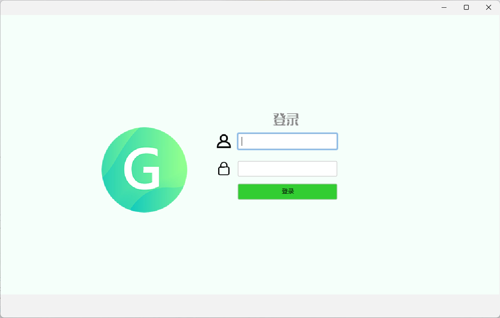
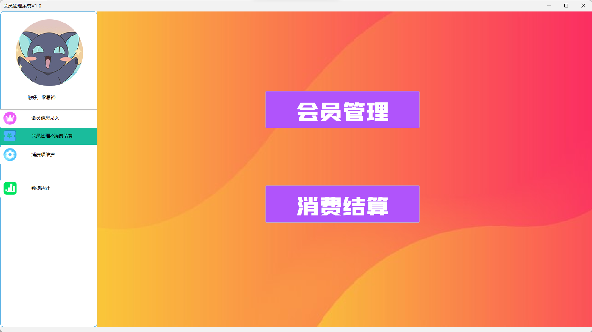
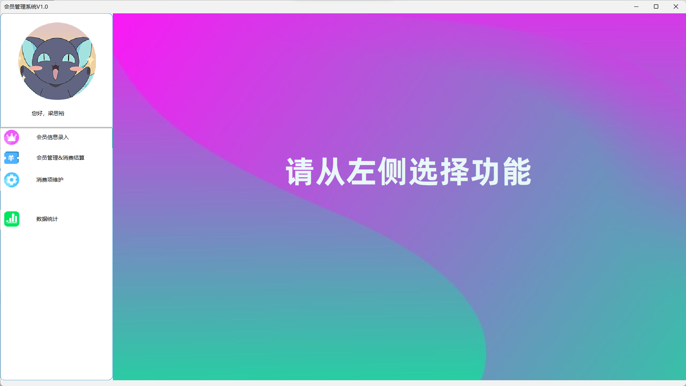

# Member Manager
大一的结课作业，美和易思的受害者 :innocent:

*Quietly cursed, I think this school of a certain teacher and the management system of this school is really excessively poor*

完全用swing实现的界面，个人觉得很好看（接受反驳，但我不听:pray::pray::pray::pray:）

# ScreenShots


# 用到的第三方库
通过Maven构件，有需要可直接复制
* MYSQL(这个就不用解释是啥了吧):
```xml
<dependency>
        <groupId>mysql</groupId>
        <artifactId>mysql-connector-java</artifactId>
        <version>8.0.29</version>
    </dependency>
```
* DatePicker(一个日期选择器)
```xml
 <dependency>
        <groupId>io.loli</groupId>
        <artifactId>datepicker4j</artifactId>
        <version>0.0.5</version>
    </dependency>
```
* junit(这个懂得都懂):

```xml
<dependency>
        <groupId>junit</groupId>
        <artifactId>junit</artifactId>
        <version>4.13.2</version>
    </dependency>
```
* Flatf(UI库，挺符合现在的审美的):
 ```xml
 <dependency>
       <groupId>com.formdev</groupId>
       <artifactId>flatlaf</artifactId>
       <version>2.1</version>
   </dependency>
 ```

# 想用？
直接拿走，顺便求个star

# 采用 Apache-2.0 license开源协议


